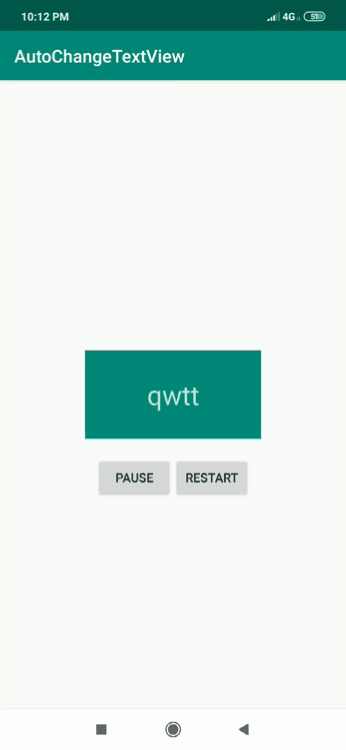

# AutoChangeTextView
[](https://jitpack.io/#aashitshah26/AutoChangeTextView)


This project will help you to enter array of texts which will be showed one after one in text view after a given delay with/without animation .



To add AutoChangeTextView in your project follow the following steps :-

## Installing

Add [JitPack](https://jitpack.io) repository to your root `build.gradle`

```gradle
allprojects {
    repositories {
        // ...
        maven { url 'https://jitpack.io' }
    }
}
```
Add dependency to your module `build.gradle`:

```gradle
implementation 'com.github.aashitshah26:AutoChangeTextView:1.0'
```

## Usage

Add *AutoChangeTextView* to your layout:

```xml
<LinearLayout xmlns:android="http://schemas.android.com/apk/res/android"
    android:layout_width="match_parent"
    android:layout_height="match_parent">
     <com.aashit.library.AutoChangeTextView
       android:id="@+id/auto"
        android:layout_width="wrap_content"
        android:layout_height="wrap_content"
        app:texts="@array/try1"
        app:duration="1000"
        app:animate="false"
        android:textSize="20dp"
        android:gravity="center"
        android:textColor="#ffffff"
        android:background="@color/colorPrimary"/>
</LinearLayout>
```

Initialize *AutoChangeTextView* in your activity:

```java


public class MainActivity extends AppCompatActivity {
    AutoChangeTextView autoChangeTextView;
    ArrayList<String> arrayList=new ArrayList<>();

    @Override
    protected void onCreate(Bundle savedInstanceState) {
        super.onCreate(savedInstanceState);
        setContentView(R.layout.activity_main);
        arrayList.add("asdsad");
        arrayList.add("qweerr");
        arrayList.add("qwtt");
        arrayList.add("vsddfdsf");
        arrayList.add("utrtyty");
        autoChangeTextView = findViewById(R.id.auto);
        //To set in and out animations for all the texts.. 
        autoChangeTextView.setInAnimation(AnimationUtils.loadAnimation(this,android.R.anim.slide_in_left));
        autoChangeTextView.setOutAnimation(AnimationUtils.loadAnimation(this,android.R.anim.slide_out_right));
        autoChangeTextView.setTexts(arrayList);//Sets the arraylist,String array,array resource id as texts.
        autoChangeTextView.setDuration(500,AutoChangeTextView.MILLISECONDS);//Sets the duration of texts change
       
        autoChangeTextView.setAnimate(true);//Turn animation on and off...
    }

    public void restart(View view) {
        autoChangeTextView.restart();//Will restart the changing of texts.
    }

    public void pause(View view) {
        autoChangeTextView.pause();//Will pause the changing of texts.
    }
}
```

## License 

MIT License

Copyright (c) 2019 Aashit Shah

Permission is hereby granted, free of charge, to any person obtaining a copy of this software and associated documentation files (the "Software"), to deal in the Software without restriction, including without limitation the rights to use, copy, modify, merge, publish, distribute, sublicense, and/or sell copies of the Software, and to permit persons to whom the Software is furnished to do so, subject to the following conditions:

The above copyright notice and this permission notice shall be included in all copies or substantial portions of the Software.

THE SOFTWARE IS PROVIDED "AS IS", WITHOUT WARRANTY OF ANY KIND, EXPRESS OR IMPLIED, INCLUDING BUT NOT LIMITED TO THE WARRANTIES OF MERCHANTABILITY, FITNESS FOR A PARTICULAR PURPOSE AND NONINFRINGEMENT. IN NO EVENT SHALL THE AUTHORS OR COPYRIGHT HOLDERS BE LIABLE FOR ANY CLAIM, DAMAGES OR OTHER LIABILITY, WHETHER IN AN ACTION OF CONTRACT, TORT OR OTHERWISE, ARISING FROM, OUT OF OR IN CONNECTION WITH THE SOFTWARE OR THE USE OR OTHER DEALINGS IN THE SOFTWARE.
